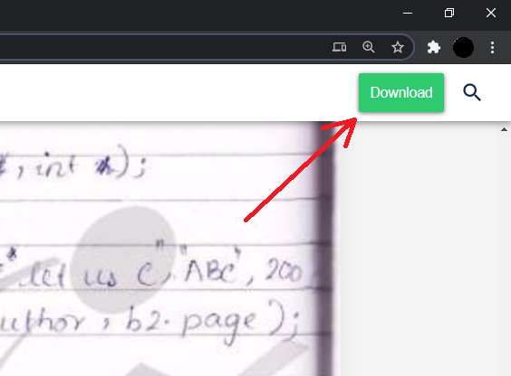

    

<h1 align="center">Lecturenotes downloader</h1>

    

### `Steps`
1. Go to [lecturenotes.in](https://lecturenotes.in/) and choose your notes
1. Then click on `read now` button in lecturesnotes.in webpage.
1. Then the chrome extension will be automatically loaded. 
1. Hit  button
